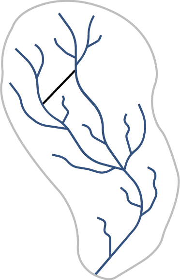
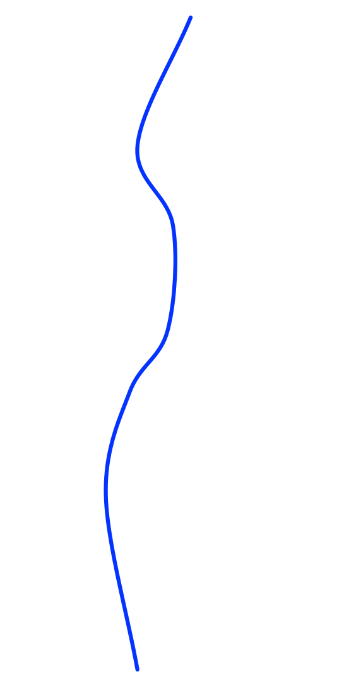
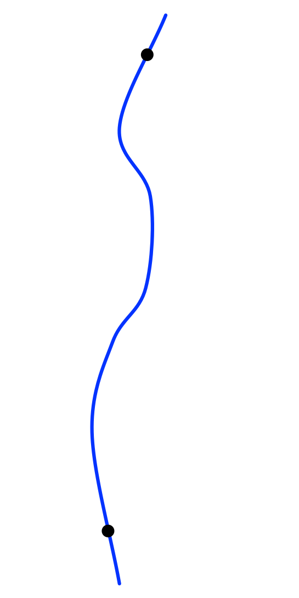
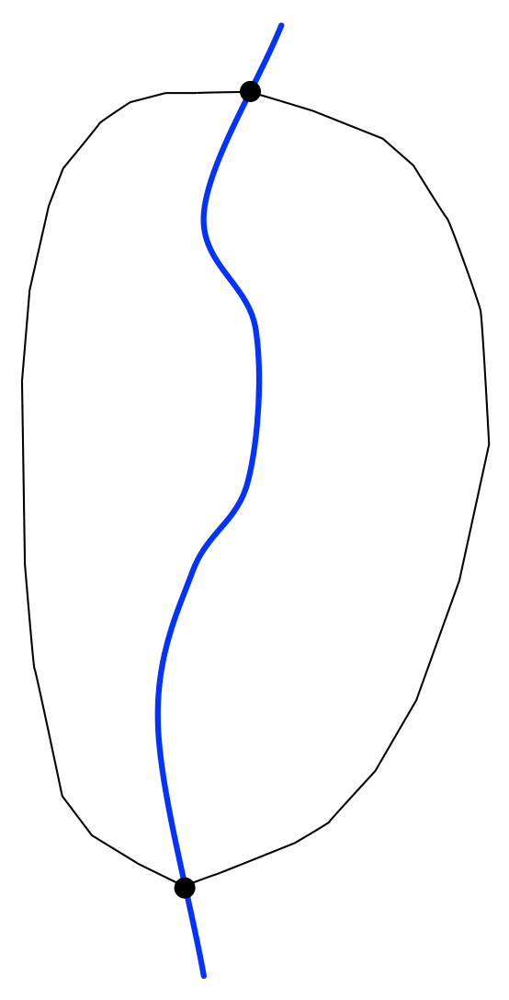
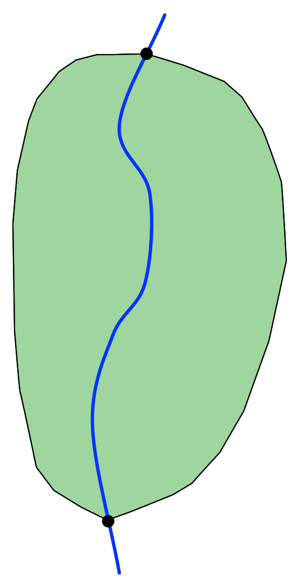
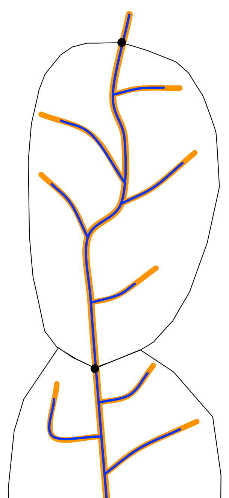

# Short Link: https://goo.gl/#analytics/goo.gl/tun2d2/all_time

WaterML2 Part 3: Surface Hydrology Features (HY_Features)
========================================================
author: David L. Blodgett
date: 06-2017
width: 1440
height: 900
A conceptual feature model for surface hydrology.

For more info, visit the [SWG home page.](http://www.opengeospatial.org/projects/groups/hydrofeatswg)

If you are an OGC member, [get the latest spec on pending docs.](https://portal.opengeospatial.org/files/?artifact_id=74219&version=2)

Latest version of this [presentation here.](http://opengeospatial.github.io/HY_Features/HY_Features_primer/HY_Features_Primer.html#/)

  </img>

========================================================
left: 60%

**What is HY_Features?**

1

HY_Features is a conceptual model describing hydrology features and their relationships

- The model describes hydrology specific feature types, e.g. catchments, drainage networks, rivers, lakes and waterbodies.
- Defined in the Unified Modeling Language (UML).
- All features specialize the General Feature of the ISO / OGC General Feature Model.
- Most features "specialize" a general HY_HydroFeature providing multilingual naming.
- HY_Features models hydrologic units and surface waterbodies.
- Focus is on surface water features and the networks they form.

***

========================================================

**What is HY_Features for?**

HY_Features provides a common conceptual basis for
identification of hydrologic features.

This should help provide:

1. shared feature types defined for use in the hydrology domain,
2. a common language for documenting datasets,
3. a standard conceptual model for data and software,
4. a means to unify hydrologic feature identities across data products.

  </img>

2

========================================================

**What kinds of features are in HY_Features?**

HY_Features includes: hydrologic units,
the junction features that join them, and the waterbody
features that drain them. The core feature concepts are:

- **catchment**: a holistic and abstract hydrologic unit concept, that links inflow and outflow.
- **hydro nexus**: a holistic and abstract junction concept, that connects interacting catchments.
- **realization**: a hydrology-specific way of interpreting a holistic feature.
- **waterbody**: an identified body of water, that accumulates runoff in a catchment.
- **container**: a depression or channel that may hold a waterbody, that drains a catchment.
- **hydro network**: a network of catchments that forms a larger, containing catchment. 

Note: Catchment and nexus are not modeled as abstract classes in UML. Abstract 
is used to describe that these are meant to represent the abstract notion 
of a hydrologic unit or junction.

3

========================================================

**What is a catchment?**

Catchment is a holistic abstract notion of a hydrologic unit (a feature type).

It is a physiographic unit defined by a common outlet (and
potentially an upstream inlet.)

In other words a catchment is...
- the basic unit of study in hydrology and water resources management
- a hydrologic system that drains to a defined outlet
- an area in which hydrologic processes take place
- the link from one inlet hydro nexus to one outlet hydro nexus

4

========================================================

**What is a Hydro Nexus?**

A hydro nexus is a place where two or more catchments interact.

Theoretically, there is a hydro nexus anywhere on the landscape.

However, we usually identify significant places to break up our catchments.

A hydro nexus...
- can act as a pour point at the boundary of a catchment
- can act as an inlet to or an outlet from a catchment
- can receive flow from and give flow to multiple catchments

Note: Typically, a hydro nexus is a location at the end of a flow path, but other
realizations, such as areas of infiltration, could be introduced in future work. 

5

========================================================

**What is hydrologic realization?**

Catchment and hydro nexus are meant to be holistic and
have several hydrology-specific interpretations.

HY_Features deals with this by saying they can be **realized** in a number of ways.

<small>_Note that "realization" and "realized" are UML class association names between a holistic feature (the realized feature) and a specific feature (the realization feature)._</small>

6

========================================================

**What is hydrologic realization?**

As shown in this figure, a catchment can be
realized as a divide (A.), an area (B.), a main flowpath (C.), a network
of catchments (D.), a network of waterbodies (E.), a dendritic topologic network (F.),
a complex feature network (G.), or a collection of monitoring sites (H.).

<small>_Note that these realizations are meant to be conceptual.
The graphics are only meant to illustrate the concept._</small>

7

========================================================

**How do waterbodies work in HY_Features?**

- First, consider a main flowpath waterbody of a catchment. 
- Zoom out to a network of sub-catchments and their flowpaths. 
- Now we have a network of waterbodies, each of which is a realization of a sub-catchment.

8

========================================================
left: 70%

9

**How do waterbodies work in HY_Features?**

- A main flowpath or network of waterbodies realizes a catchment.

- A main flowpath or network delivers a catchment's flow to a hydro nexus.

- A hydro nexus is realized by a hydro location on the waterbody network.

***

========================================================
left: 70%

10

**Waterbody -- Hydro Location and Catchment -- Hydro Nexus**

The relationship between these four types of features, is
best illustrated as a sequence of steps.

1. Given a **waterbody** feature, lets say it's a line.

***

========================================================
left: 70%

11

**Waterbody -- Hydro Location and Catchment -- Hydro Nexus**

The relationship between these four types of features, is
best illustrated as a sequence of steps.

1. Given a **waterbody** feature, lets say it's a line.
2. Choose two locations on that line, you have two **hydrologic locations**.

***

========================================================
left: 70%

12

**Waterbody -- Hydro Location and Catchment -- Hydro Nexus**

The relationship between these four types of features, is
best illustrated as a sequence of steps.

1. Given a **waterbody** feature, lets say it's a line.
2. Choose two locations on that line, you have two **hydrologic locations**.
3. Delineate the **divide** around the area that drains to the blue line.

***

========================================================
left: 70%

13

**Waterbody -- Hydro Location and Catchment -- Hydro Nexus**

The relationship between these four types of features, is
best illustrated as a sequence of steps.

1. Given a **waterbody** feature, lets say it's a line.
2. Choose two locations on that line, you have two **hydrologic locations**.
3. Delineate the **divide** around the **area** that contributes to the blue line between the two hydro locations.

***

========================================================
left: 70%

14

**Waterbody -- Hydro Location and Catchment -- Hydro Nexus**

The relationship between these four types of features, is
best illustrated as a sequence of steps.

1. Given a **waterbody** feature, lets say it's a line.
2. Choose two locations on that line, you have two **hydrologic locations**.
3. Delineate the **divide** around the **area** that drains to the blue line.
4. Give the delineated hydrologic unit a name and ID. This is your **catchment**.

***

========================================================
left: 70%

15

**Waterbody -- Hydro Location and Catchment -- Hydro Nexus**

The relationship between these four types of features, is
best illustrated as a sequence of steps.

1. Given a **waterbody** feature, lets say it's a line.
2. Choose two locations on that line, you have two **hydrologic locations**.
3. Delineate the **divide** around the **area** that drains to the blue line.
4. Give the delineated hydrologic unit a name and ID. This is your **catchment**.
5. Now that you have identified your catchment, you can consider your hydrologic locations to be realizations of **hydrologic nexuses** of your catchment.

***

========================================================
left: 70%

16

**Waterbody -- Hydro Location and Catchment -- Hydro Nexus**

Now we have catchment *12* with inflow hydro nexus *34* and
outflow hydro nexus *56*.

Catchment *12* is realized as a linear *divide* polygon, a planar *area*
and a main *flowpath* line.

Hydro nexuses *34*, and *56* are realized as hydro locations.

***

========================================================
left: 70%

17

**Waterbody -- Hydro Location and Catchment -- Hydro Nexus**

In many cases, several alternate geometric representations 
for the catchment defined between Nexus 34 and 56 will exist:

- for mapping at different scales
- from differing data capture or processing methods 
(e.g raster, vector)
- originating from different organizations
- for representing different processes, for example 
surface water or groundwater contributing catchments

As long as alternate data products represent the same 
hydrology-specific catchment realization and identify 
the same realized catchment, they can be associated 
directly along with any related data and reports.

***

========================================================
left: 70%

18

**Networks of Waterbodies or Channels and Catchment Interactions**

A catchment can be realized as a network of waterbodies, 
shown here as a simple network of blue lines meant to represent
waterbodies. 

A catchment can also be realized as the network of its channels, 
shown here as a network of orange lines that may contain the waterbodies.

Also illustrated here, two catchments and their associated waterbodies/channels
interact at a hydrologic location that is referenced to the waterbody/channel 
network that realizes the whole catchment.

***

========================================================
left: 75%

19

**Networks of Waterbodies or Channels and Catchment Interactions**

If we create hydro locations at junctions in the waterbody network 
and associate them with hydro nexuses and catchments, it becomes clear 
that a waterbody or catchment (boundary) network is also be a 
network of many individual catchment realizations.

If we connect water bodies with hydro locations at 
their inlets and outlets, we get a network of catchments interacting at 
their hydro nexuses. By using consistent identifiers for the hydro 
nexuses and the associated catchments, datasets representing 
waterbodies/channels that are built at different scales can be 
tied together.

The ability to both tie datasets together accross scales and to 
support linking various data sets that represent the same real-world 
features, is the primary goal of HY_Features conceptual model. Future 
work will be able to build on this conceptual basis, adding formal 
encodings for linking data together and encoding hydrographic data 
directly.

***

========================================================
left: 75%

20

**Ways of Conforming to HY_Features -- Conformance Classes**

**1) Data Model Mapping**  
HY_Features can be useful in describing the characteristics of an existing data 
model. In this case, conformance is accomplished by recording how a given dataset 
"maps" onto HY_Features. Note that the actual level of coorespondence can be low. 
As long as the mapping itself considers all mandatory elements of HY_Features, it 
would be considered conformant. 

**2) Implementation of an Encoding of HY_Features**  
In this case, all mandatory properties, associations, and default values are 
required in the implementation for one or more HY_Features feature type. Implementations 
would necessarily extend and profile the HY_Features conceptual model, adding specific 
geometric representations and specifying which HY_Features featuretypes are to be included.

***

  </img>

